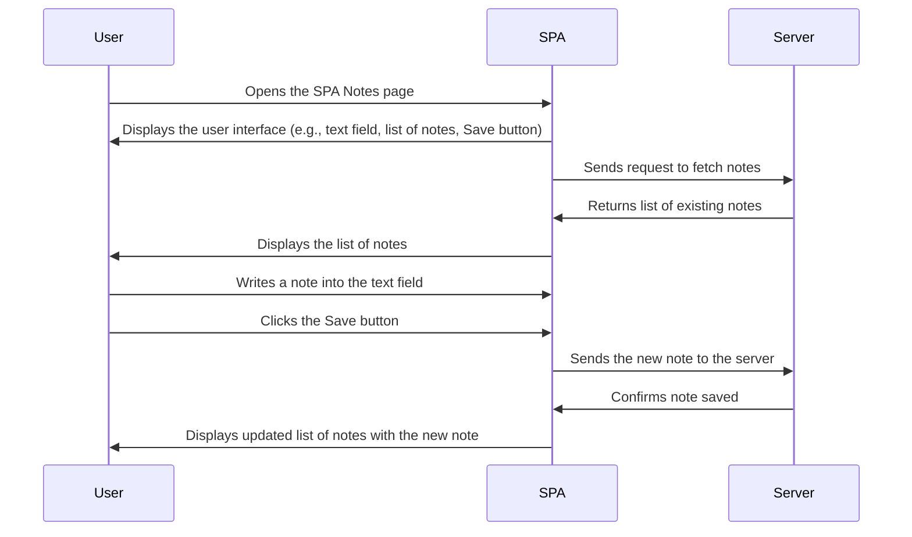

```mermaid
sequenceDiagram
    participant User
    participant SPA
    participant Server

    User->>SPA: Opens the SPA Notes page
    SPA->>User: Displays the user interface (e.g., text field, list of notes, Save button)
    SPA->>Server: Sends request to fetch notes
    Server->>SPA: Returns list of existing notes
    SPA->>User: Displays the list of notes
    User->>SPA: Writes a note into the text field
    User->>SPA: Clicks the Save button
    SPA->>Server: Sends the new note to the server
    Server->>SPA: Confirms note saved
    SPA->>User: Displays updated list of notes with the new note

```